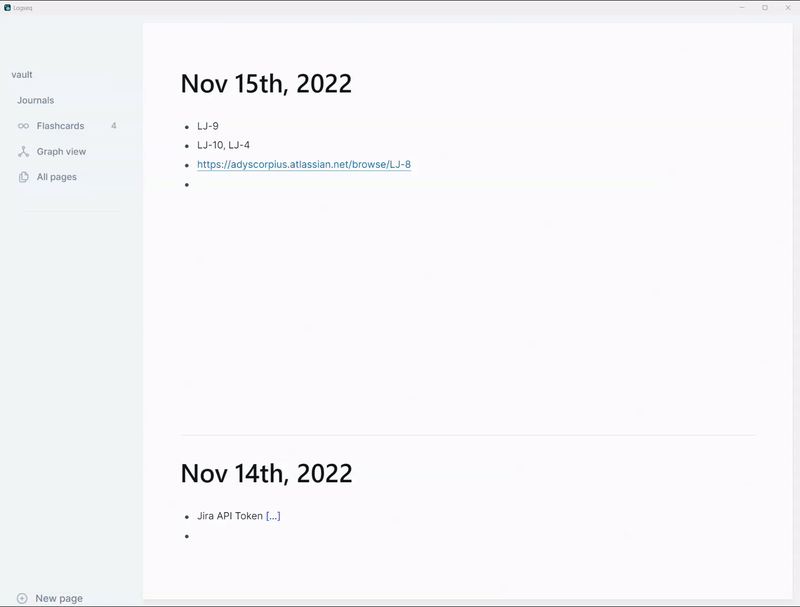

## Logseq Jira Sync Plugin

Bring Jira issue status and summaries to Logseq with this plugin. Check out the discussion on Logseq Forums by [clicking here](https://discuss.logseq.com/t/logseq-jira-plugin/12414?u=adit)

## Quick Start

Start by using `ctrl+shift+j` in a block containing a JIRA issue key or link.

## What it does?

## Current Functionality

1. Use the slash command "Update Jira Issue" to replace issue keys (PM-100, ISS-1432143, etc.) or issue links like subdomain.atlassian.net/browse/PM-100 with `[<status>|<issueKey>|<issueSummary>](https://orgname.atlassian.net/browse/<issueKey>)` format.

### Known Limitations

1. Only works for the current block.
2. Doesn't auto-refresh to keep issue status updated.
3. Currently only supports Jira Cloud.

### Roadmap

- [x]  Refresh summary on rerun on existing links.
- [ ]  Auto refresh/update all links on current page.
- [ ]  Auto refresh all Jira links across vault (need to verify performance impact on doing this).
- [ ]  Create your own Link description format with Jira variables ( '{issueKey} - {status} - {summary}' )

### Download

The plugin is available to download directly from Logseq's Plugins marketplace. Alternatively, you can download the latest release from [Releases](https://github.com/adyscorpius/logseq-jira/releases) published on Github.

### How to build the plugin

- Git clone the repository to your local system. Or download and extract to a known path.
- `npm install && npm run build` in terminal to install dependencies and generate distribution folder.
- Enable Developer mode in Logseq by going to Settings -> Advanced -> Turn on Developer Mode.
- `Load unpacked plugin` in Logseq Desktop client and select the folder for the plugin on your disk.
- For updates, git pull the main branch and 'Reload Package' under Plugins > Logseq Jira.

