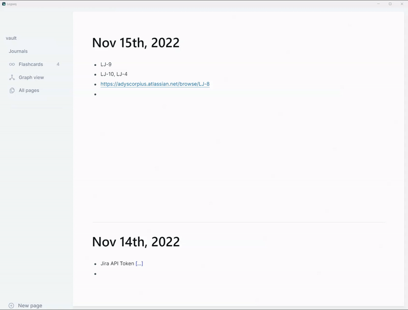

# Logseq-JIRA Plugin

The Logseq-JIRA plugin allows users to integrate their JIRA issue data into Logseq for personal notes and tracking. This document provides detailed information on setting up and configuring the plugin.

Check out the discussion on Logseq Forums by [clicking here](https://discuss.logseq.com/t/logseq-jira-plugin/12414?u=adit)

## Installation

1. Download the Logseq-JIRA plugin from the official repository.
2. Install the plugin in Logseq by navigating to `Plugins` > `Install Plugin`.
3. Upload the plugin file and follow the installation prompts.

## Configuration

### Primary JIRA Account Settings

Configure the primary JIRA account with the following settings:

| Setting Key             | Title                    | Description                                                                                         | Type    | Default                    |
|-------------------------|--------------------------|-----------------------------------------------------------------------------------------------------|---------|----------------------------|
| jiraBaseURL             | JIRA Base URL            | Enter your JIRA instance's base URL (e.g., xyz.atlassian.net). Do not include 'https://' or a trailing '/'. | String  | orgname.atlassian.net      |
| jiraUsername            | JIRA Username            | Enter your JIRA username (usually your email address).                                              | String  | ""                         |
| jiraAPIToken            | JIRA API Token           | Enter your JIRA API token. You can generate one [here](https://support.atlassian.com/atlassian-account/docs/manage-api-tokens-for-your-atlassian-account/). | String  | ""                         |
| jiraAuthType            | JIRA Authentication Method | Choose your authentication method: Basic Auth or Personal Access Tokens.                             | Enum    | Basic Auth                 |
| jiraAPIVersion          | JIRA API Version         | Select the API version your organization uses. Change this only if you use an older on-premise version. | Enum    | 3                          |

### Display Options for JIRA Data

Customize how JIRA issue details are shown in your notes:

| Setting Key             | Title                    | Description                                                                                         | Type    | Default                    |
|-------------------------|--------------------------|-----------------------------------------------------------------------------------------------------|---------|----------------------------|
issueLinkTextFormat | Issue Format  | Issue link text customization. | String | %statuscategoryicon% %statuscategoryname% - %key%\|%summary% |
issueLinkTextFormatOrgMode | Issue Format For Org Mode | Issue link text customization for Org Mode. | String | %statuscategoryicon% %statuscategoryname% - %key%\|%summary% |
| updateInlineText        | Hyperlink JIRA Issue Keys | Automatically hyperlink JIRA issue keys with their summaries.                                       | Boolean | true                       |
| autoRefresh             | Auto Refresh Jira Links | Experimental: Automatically refresh all links at start of Logseq.                                       | Enum | No                       |
| enableOrgMode            | Support for Org-Mode vaults | If you use org mode for your content, enable this flag. Turned off by default | Boolean | false                      |
| addToBlockProperties    | Add JIRA Fields as Block Properties | Include additional JIRA fields as properties in your text blocks.                                    | Boolean | false                      |
| showSummary             | Show Summary             | Display the issue summary.                                                                          | Boolean | false                      |
| showAssignee            | Show Assignee            | Display the issue assignee.                                                                         | Boolean | false                      |
| showPriority            | Show Priority            | Display the issue priority.                                                                         | Boolean | false                      |
| showFixVersion          | Show Fix Version         | Display the fix version.                                                                            | Boolean | false                      |
| showStatus              | Show Status              | Display the issue status.                                                                           | Boolean | false                      |
| showReporter            | Show Reporter            | Display the issue reporter.                                                                         | Boolean | false                      |
| showResolution          | Show Resolution          | Display the issue resolution.                                                                       | Boolean | false                      |
| appendCustomTags          | Append your custom tags          | Append your custom tags.                                                                       | String | ""                      |

### Settings for a Second JIRA Account (Optional)

Configure a second JIRA account if needed:

| Setting Key             | Title                    | Description                                                                                         | Type    | Default                    |
|-------------------------|--------------------------|-----------------------------------------------------------------------------------------------------|---------|----------------------------|
| enableSecond            | Enable Second JIRA Account | Enable or disable settings for a second JIRA account. Reload the plugin or restart Logseq after changing this setting. | Boolean | false                      |
| jiraBaseURL2            | JIRA Base URL for Second Account | Enter the base URL for your second JIRA instance (e.g., xyz.atlassian.net). Do not include 'https://' or a trailing '/'. | String  | orgname.atlassian.net      |
| jiraUsername2           | JIRA Username for Second Account | Enter the username for your second JIRA account (usually an email address).                           | String  | ""                         |
| jiraAPIToken2           | JIRA API Token for Second Account | Enter the API token for your second JIRA account. You can generate one [here](https://support.atlassian.com/atlassian-account/docs/manage-api-tokens-for-your-atlassian-account/). | String  | ""                         |
| jiraAuthType2           | JIRA Authentication Method for Second Account | Choose the authentication method for your second account: Basic Auth or Personal Access Tokens.       | Enum    | Basic Auth                 |
| jiraAPIVersion2         | JIRA API Version for Second Account | Select the API version used by your second JIRA instance. Change this only if you use an older on-premise version. | Enum    | 3                          |

### Possible issue text customization tokens (case insensitive) - New Feature
* %key%
* %statusCategoryIcon%
* %statusCategoryName%
* %summary%
* %assignee%
* %priority%
* %fixVersion%
* %status%
* %issuetype%
* %creator%
* %reporter%
* %resolution%

## Usage

Once the plugin is configured, you can start pulling JIRA issue data into Logseq. The plugin will automatically update JIRA issue keys with their summaries and display additional JIRA fields as specified in the settings.

- For updating Jira queries, enter the JIRA URL or Issue Key like 'PROJ-123' and the type /Jira, select 'Jira: Update Issue' to use the first organization's credentials, or 'Jira: Update Issue for 2nd Org.' for 2nd organization's credentials.
- For pulling results from a JQL, type /Jira and select "Jira: Pull JQL results".

### Example Usage

To insert a JIRA issue into your Logseq notes, simply type the issue key (e.g., `PROJ-123`), then type /Jira and select Update JIRA Issue to fetch and display the issue details based on your configuration.

### Block Properties

If you enable the block properties settings, the plugin will add additional JIRA fields as properties to your text blocks, allowing you to see detailed information about each issue at a glance.

## Example Demo

### Current functionality

1. Find and replace all JIRA URLs in the current block.
2. Support for inline updates or appending block properties (Unique to Logseq)
3. Supports both **Jira Cloud** and **Jira On-Premise** and API versions V3 and V2. (*On Premise version is untested by developer, but community supported.*)

### Roadmap

- [x]  Refresh summary on rerun on existing links.
- [x]  Add more fields to help with context of the tickets
- [x]  Added support for two Jira instances/organizations.
- [x]  Experimental: Support for JIRA On-premise
- [x]  Experimental: Support for JQL queries in children blocks (maxes out at 50 right now)
- [x]  Experimental: Auto refresh/update all links when page is loaded. 
- [x]  Support for Org Mode vaults. 
- [x]  Create your own Link description format with Jira variables ( '{issueKey} - {status} - {summary}' )
- [ ]  Auto refresh all Jira links across vault (need to verify performance impact on doing this).

### How to build the plugin

- Git clone the repository to your local system. Or download and extract to a known path.
- `pnpm install && pnpm build` in terminal to install dependencies and generate distribution folder.
- Enable Developer mode in Logseq by going to Settings -> Advanced -> Turn on Developer Mode.
- `Load unpacked plugin` in Logseq Desktop client and select the folder for the plugin on your disk.
- For updates, git pull the main branch and 'Reload Package' under Plugins > Logseq Jira.

### Release process

- Update version in package.json
- Add all updates to master branch
- Tag the latest commit with new version.

## Troubleshooting

If you encounter any issues, please check the following:

- Ensure your JIRA base URL, username, and API token are correct.
- Verify your JIRA instance's API version.
- Make sure you have enabled the necessary settings for displaying JIRA data.

For further assistance, please refer to the plugin's documentation or contact support.

## Contributing

Contributions to the Logseq-JIRA plugin are welcome. If you would like to contribute, please fork the repository and submit a pull request with your changes.

## License

The Logseq-JIRA plugin is open-source software licensed under the [MIT License](LICENSE).
